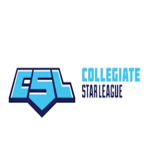
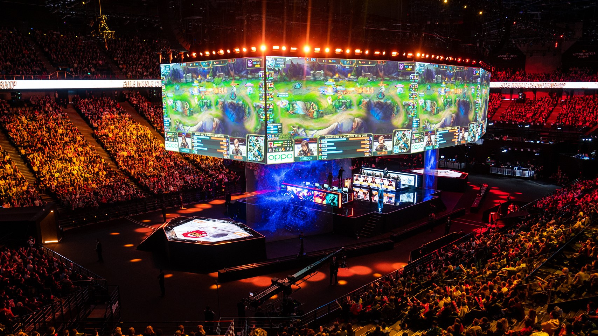

  

I'm hoping that this shows how committed I can be when trying to get better at something I enjoy as I've been playing this game consistently for 8 years and I can consistently rank in the top 1% of players in the North American region, which unfortunately still isn't even the top 600 players, but I am still motivated and striving to reach that. Luckily for those of us who enjoy playing competitive video-games, we are in a generation in which eSports as a whole has blown up worldwide and become a billion-dollar industry which allows organizations to run university-based tournaments for students such as CSL (cstarleague) that is similar to those of traditional sports univeristy org's such as NCAA. This gives students opportunities to play qualified games in an organized team environment and and also allows us to play for cash prizes and/or scholarship money.

  

## Benefits
I honestly didn't expect to learn as much as I have in terms of aspects that would benefit me academically or for computer science in general, but I was wrong. With League of Legends being a highly dependent team game, everyone needs to be on the same page as small mistakes can potentially lose you the game if you let it continuously build up. So by joining this collegiate esports team, a big skill we always continue to try to work on is communication and teamwork which is relevant to being a computer scienctist because it is important to collaborate and work well with other programmers especially when working on projects like creating and developing apps/games.

