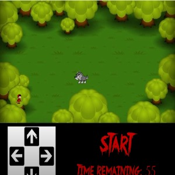

This was the first game I've coded using Java and Jason Leigh's EZ programming code. The requirements of the game was to have an object randomly teleport to a different spot on the screen as well as to be able to control a character with a game-pad and a score-tracker, and although I think the overall presentation of this project looks very poor as I used whatever I could find on google images, I feel that what's most important is that the code works as I intended it to in which you (the wolf) can eat catch little red riding hood as many times as possible before the time limit. 

This was also a small introduction to AI's which I didn't really implement for my project, but I've been fascinated with AI's especially in video games because I've enjoyed playing games such as Dark Souls which is notoriously known for having hard boss battles.
