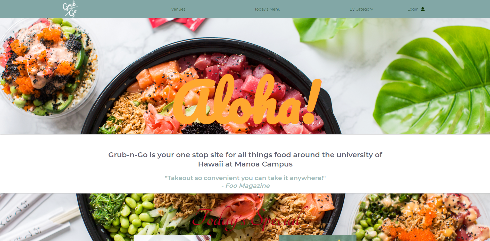

## Grub-N-Go

  

The goal of our [Grub-N-Go](https://grub-n-go.github.io/) web application was to allow students on the UH Manoa campus to view available vendors around the campus, citing their location, hours of availability and their menus. In more detail, it also allows the users to choose the category of food they're looking for (Chinese, local, French, etc), and the application shows them what available vendors have that type of food. It is not only a site for the students, but for vendors as well, as vendors will be able to sign up to the site to allow them to display their credentials on the site. 

## My Contribution & What I got from this Experience
The pages I worked on were the Venues page, parts of the landing page, and adding most of the default vendors as well as their menus from the [UH Manoa Food Services](https://manoa.hawaii.edu/food/) site. The things I've learned that I find useful from this experience is the web development and web design skills which we utilized to create the web application's look and general functionality. I also value the experience with working in a group using the github project board, as this is an efficient way to break down tasks for a project, to work up to the final result.

